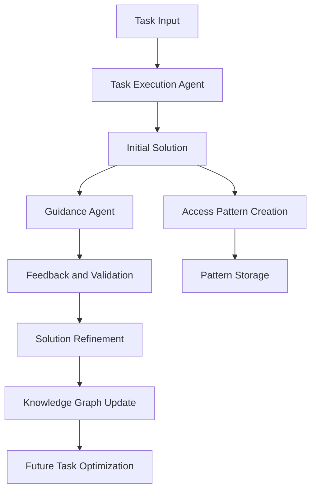

# Nexus Components and Architecture

## System Overview

Nexus implements a dual-LLM architecture centered around a mentor-mentee relationship, where one LLM (mentor) guides and validates the work of another LLM (mentee). This approach ensures higher quality solutions through continuous feedback and validation.

## Core Components

### 1. Dual-Agent System

#### Task Execution Agent (Mentee LLM)
- Primary code writer and task implementer
- Proposes initial solutions and approaches
- Implements changes based on mentor feedback
- Explains reasoning behind implementation choices
- Asks questions when uncertain

#### Guidance Agent (Mentor LLM)
- Reviews proposed solutions
- Identifies potential issues early
- Explains architectural considerations
- Suggests improvements and alternatives
- Provides context from knowledge base
- Has access to:
  - Web search capabilities
  - HTML inspection tools
  - Graph database queries
  - Pattern repository

### 2. Knowledge Graph Database
#### Structure
- Access Patterns Storage
  - Implementation approaches
  - Success metrics
  - Failure cases
  - Performance characteristics

- Solution Flows
  - Step-by-step methodologies
  - Decision points
  - Alternative approaches
  - Error handling strategies

- Domain Knowledge
  - Best practices
  - Common pitfalls
  - Tool usage patterns
  - Framework-specific guidelines

#### Query System
- Pattern matching
- Similarity search
- Context-aware retrieval
- Relevance ranking

#### Knowledge Evolution
- Pattern refinement
- Success tracking
- Usage statistics
- Automated updates

### 3. Web Content Analysis
#### Inspection Tools
- HTML source viewer
- DOM structure analyzer
- Text content extractor
- Markdown converter

#### Search Integration
- Focused web searches
- Result filtering
- Content relevance scoring
- Source credibility checking

### 4. Access Pattern System
#### Pattern Discovery
- Solution analysis
- Pattern extraction
- Performance profiling
- Reusability assessment

#### Pattern Optimization
- Execution path analysis
- Resource usage optimization
- Parallel execution opportunities
- Error handling improvements

#### Pattern Storage
- Efficient indexing
- Quick retrieval
- Version control
- Pattern composition

### 5. Collaboration Framework
#### Agent Communication
- Message passing system
- State synchronization
- Priority management
- Conflict resolution

#### Task Orchestration
- Workflow management
- Task distribution
- Progress monitoring
- Result aggregation

#### Solution Refinement
- Performance analysis
- Solution comparison
- Iterative improvement
- Quality assurance

## Data Flow



## Component Interactions

### Task Execution Flow
1. Task received by system
2. Mentee LLM proposes initial approach
3. Mentor LLM reviews and provides feedback
4. Mentee implements solution with guidance
5. Mentor validates implementation
6. Solution stored in knowledge graph

### Knowledge Acquisition
1. Mentor LLM identifies knowledge gaps
2. Searches web resources and knowledge graph
3. Extracts relevant information
4. Validates against existing patterns
5. Guides mentee in applying new knowledge

### Pattern Storage
1. Successful solutions analyzed
2. Patterns extracted and validated
3. Stored in graph database with metadata
4. Linked to related patterns and contexts
5. Tagged for efficient retrieval

## Implementation Details

### Agent Communication
```go
type MentorAgent interface {
    // Guidance capabilities
    ReviewSolution(solution Solution) Review
    ProvideContext(query Query) Context
    SearchKnowledge(topic Topic) []Pattern
    ValidateImplementation(code Code) ValidationResult
}

type MenteeAgent interface {
    // Implementation capabilities
    ProposeSolution(task Task) Solution
    ImplementCode(design Design) Code
    ExplainReasoning(decision Decision) Explanation
    ApplyFeedback(review Review) Improvement
}

type AgentCollaboration interface {
    // Collaboration methods
    InitiateDiscussion(topic Topic) Discussion
    ShareContext(context Context)
    ReachConsensus(proposals []Proposal) Decision
}

type Agent interface {
    // Core agent functionality
    Execute(task Task) Result
    Analyze(solution Solution) Analysis
    Optimize(analysis Analysis) Improvement
    Collaborate(agents []Agent) Solution
}

type SpecializedAgent interface {
    Agent
    // Specialized capabilities
    GetExpertise() Domain
    ProvideFeedback(solution Solution) Feedback
}
```

### Knowledge Graph
```go
type KnowledgeGraph interface {
    // Graph operations
    StorePattern(pattern Pattern) PatternID
    QueryPatterns(criteria Criteria) []Pattern
    UpdatePattern(id PatternID, update Update) bool
    FindSimilar(pattern Pattern) []Pattern
    
    // Analytics
    TrackUsage(pattern Pattern)
    CalculateEffectiveness(pattern Pattern) Metrics
    SuggestImprovements(pattern Pattern) []Suggestion
}
```

### Web Extraction
```go
type HTMLQuery interface {
    // Query capabilities
    Select(selector string) []Element
    Extract(pattern Pattern) Data
    Validate(data Data) bool
    Cache(result Result, duration time.Duration)
}
```

### Access Patterns
```go
type AccessPattern interface {
    // Pattern management
    Execute() Result
    Optimize() Improvement
    Store() PatternID
    Retrieve(id PatternID) Pattern
}
```


