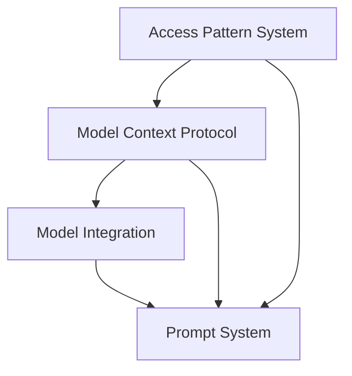

# Nexus Components Documentation

This document provides a detailed overview of the Nexus framework's components, their relationships, and architectural decisions.

## Core Components

### 1. Access Pattern System (`pkg/types`, `pkg/impl`)

#### Key Files:
- `pkg/types/access_pattern.go`: Core interfaces for access patterns
  - `IAccessNode`: Represents a node in the knowledge graph
  - `IAccessEdge`: Defines connections between nodes
  - `IAccessPattern`: Main interface for pattern management

- `pkg/impl/access_pattern.go`: Implementation of access pattern interfaces
  - Handles pattern composition and decomposition
  - Manages pattern evolution and learning
  - Provides pattern matching and execution

### 2. Model Context Protocol (`internal/mcp`)

#### Key Files:
- `internal/mcp/types.go`: Core MCP type definitions
  - Message structures
  - Tool and resource definitions
  - Protocol constants

- `internal/mcp/server.go`: MCP server implementation
  - WebSocket connection handling
  - Tool and resource management
  - Request/response handling

- `internal/mcp/client.go`: MCP client implementation
  - Connection management
  - Tool calling
  - Resource access

### 3. Model Integration (`internal/models`)

#### Key Files:
- `internal/models/base.go`: Base model implementation
  - Common model functionality
  - Configuration management
  - Token counting

- `internal/models/groq.go`: Groq model integration
  - API communication
  - Response handling
  - Tool registration

- `internal/models/ollama.go`: Ollama model integration
  - Local model management
  - Stream handling
  - Tool support

- `internal/models/mcp.go`: MCP model integration
  - MCP capability management
  - Tool and resource bridging
  - Cross-model communication

### 4. Prompt System (`prompts`)

#### Key Files:
- `prompts/fs.go`: Filesystem-based prompt storage
  - Prompt loading and caching
  - File watching
  - Metadata management

- `prompts/utils.go`: Prompt utilities
  - Variable substitution
  - Template rendering
  - Context management

## Component Relationships

## Integration Points

1. **Access Patterns ↔ MCP**
   - Access patterns guide tool selection
   - MCP provides execution capabilities
   - Shared context management

2. **MCP ↔ Models**
   - Models expose capabilities through MCP
   - Tool registration and execution
   - Resource sharing

3. **Models ↔ Prompts**
   - Dynamic prompt generation
   - Context-aware template rendering
   - Variable management

## Design Decisions

1. **Modularity First**
   - Components are loosely coupled
   - Interfaces define clear boundaries
   - Easy to extend and modify

2. **Protocol Standardization**
   - MCP as the primary communication protocol
   - Consistent message formats
   - Standardized error handling

3. **Resource Abstraction**
   - Universal resource interface
   - Pluggable storage backends
   - Flexible metadata system

4. **Pattern-Based Access**
   - Knowledge graph structure
   - Composable patterns
   - Learning capabilities

## Future Considerations

1. **Scalability**
   - Distributed pattern matching
   - Load balancing for MCP servers
   - Caching strategies

2. **Security**
   - Authentication/authorization
   - Resource access control
   - Secure communication

3. **Monitoring**
   - Pattern usage analytics
   - Performance metrics
   - Error tracking

4. **Extensions**
   - Additional model support
   - Custom tool types
   - Pattern repositories